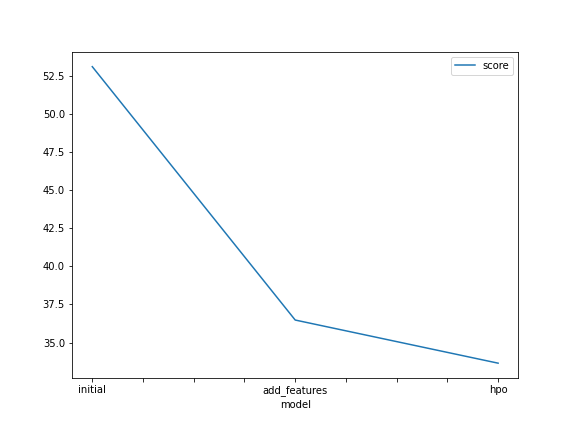
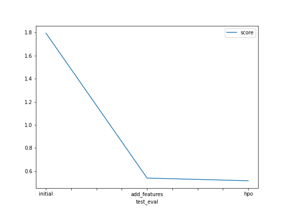

# Report: Predict Bike Sharing Demand with AutoGluon Solution
#### Ahmed Hossam

## Initial Training
### What did you realize when you tried to submit your predictions? What changes were needed to the output of the predictor to submit your results?
When I submitted the predictions without doing any feature engineering or hyperparameter tuning, the model preforms poorly and the Kaggle score was high. The output predictions that are smaller than zero were assigned to zero because there is no negative count.
### What was the top ranked model that performed?
The best model was WeightedEnsemble_L3. 
## Exploratory data analysis and feature creation
### What did the exploratory analysis find and how did you add additional features?
The histogram in the training set shows that temperature is normally distributed, while the count is right skewed as most the rentals lies within 0 to 400 range with a maximum count of 1000. In addition, datetime column was split into days, months, years, and hours. While season and weather features were converted from int to category datatype. Finally, a peak feature was added which is a value of 0 or 1, where 1 is given when the time is rush hour taking into consideration if it is a working day or not.
### How much better did your model preform after adding additional features and why do you think that is?
The model outperforms the initial model by ~70%. I think this happened because of splitting datetime into 4 features as this problem is based mainly on data, and time.
## Hyper parameter tuning
### How much better did your model preform after trying different hyper parameters?
The hyperparameter tuning increased by ~4% compared to added feature model, and ~74 compared to the initial model.
### If you were given more time with this dataset, where do you think you would spend more time?
I would focus on feature engineering, and try to come up with new features, as it is concluded that when we used a data-driven approach the accuracy increased by 70%, while hyperparameter tuning was only a 4% of improvement.
### Create a table with the models you ran, the hyperparameters modified, and the kaggle score.
|model|hpo1|hpo2|hpo3|score|
|--|--|--|--|--|
|initial|default|default|default|1.79497|
|add_features|default|default|default|0.53920|
|hpo|GBM: num_boost_round(100)|GBM: learning_rate(0.01, or 0.05, or 0.1)|NN: num_epochs(20)|0.51591|

### Create a line plot showing the top model score for the three (or more) training runs during the project.

### Create a line plot showing the top kaggle score for the three (or more) prediction submissions during the project.

## Summary
- Feature engineering & EDA can help imporving the model more than hyperparamter tuning.
- Autoglon helped me to focus on my data, and do all the machine leaning training automatically.
